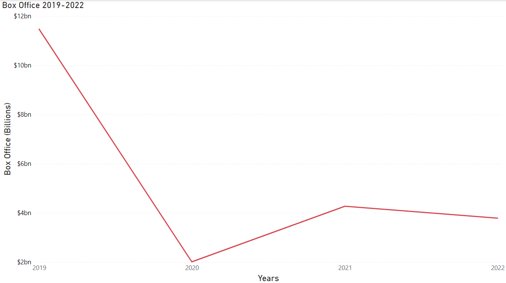

# Project Intro
My project was to analyze the impact of the box office as well as the release of films in the United States before and after COVID-19. Since COVID-19 is a current problem affecting everyone around the world, I wanted to see at how it has affected the film industry. I saw first hand how it has affected theaters since day 1, and that is why I want to find out through research how it impacted the box office. I plan to use Box Office Mojo as well as the CDC Tracker to start with my data search. Wikipedia will also be a very helpful place for data. This project will help build my skills as a data analyst, using various visualization sites such as Power BI.

# Weeks
- Week 1-2: I first collected data from a Wikipedia page that listed films impacted by COVID-19 and web scraped them through Python and then converted them into excel sheets. I then spent the next week cleaning this data to include only films that were produced in the United States, though there were many other films worldwide that were impacted by COVID-19.

- Week 3-4: I then tried to find how much box office was earned daily and though Box Office Mojo contained daily data, there was no way to gather it effectively. This led me to research other sites that might provide the required information. My search proved successful, and I discovered The Numbers, a website that also collected the box office earnings both domestically and worldwide, with the total listed at the bottom of each date.

- Week 5-6: It was then I created an excel sheet that contained daily box office data from January 2019 to June 2022, as I wanted to do a comparison of what the box office was like before and after COVID-19. I also researched where to find the daily cases of COVID-19 in the United States. I successfully found the CDC COVID-19 tracker that provided reliable data.

- Week 7-8: As I continued with my data, I found easier ways to input the required data, resulting in quicker results. I then obtained my desired objective of having not only the daily domestic box office from 2019 to June 2022, but the daily COVID cases from January 2020 to June 2022. I then decided to open a Power BI to create my visuals.

- Week 9-10: After uploading my data onto Power BI, I continued to look for other insights I could gain from my objective. It was here I decided to find out what ratings the Motion Picture Association of America gave the films, as well as what studios distributed them. I also included the streaming services that the films were released on, both for the ones that were canceled and the ones that released in theaters and on demand.

- Week 11-12: After researching The Numbers site, I then found that certain films were given a wide release in theaters compared to films released in limited theaters. I then decided to explore films released in theaters worldwide from January 2020 to June 2022.

- Week 13-14: With the extra data collected, my project was finally complete. In conclusion, COVID-19 has drastically impacted the United States cinema experience, with many films having to be pushed back or simply denied the theater option. This led to an increase of films on streaming services, as well as theaters encouraging moviegoers that the best place to see a film is on the big screen. Though COVID cases are declining in the months since its inception, with box office numbers increasing as well, we will never get the same box office numbers as before. 

# Data

- https://en.wikipedia.org/wiki/List_of_films_impacted_by_the_COVID-19_pandemic
- https://www.the-numbers.com/
- https://covid.cdc.gov/covid-data-tracker/#trends_newtestresultsreported

## Question 1: How has the box office been impacted by COVID?

To answer this question, I collected the box office data from January 2019 to June 2022 to examine how COVID impacted it. My results shown above in the first visual show a huge drop from 2019 to 2020, when COVID-19 forced many theaters to shut down. We then see with 2021 and 2022, that box office numbers are increasing from 2020, but never to the amount that was shown in 2019.

The second visual also shows how the box office went dramatically down in 2020 but immediately picked up at the start of 2021, with a slight dip in 2022, but still increasing as of June.

## Question 2: How does the box office compare to COVID cases & deaths?

